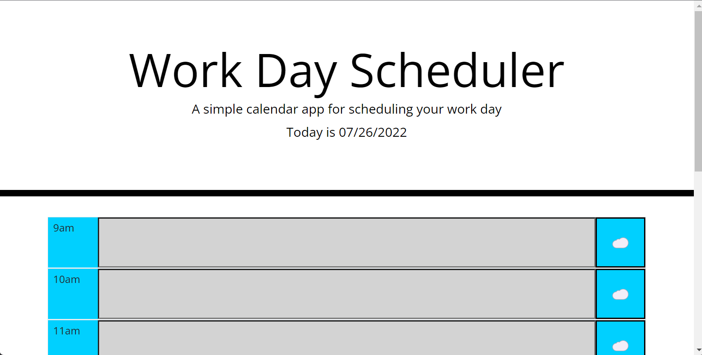

# daily-agenda-challenge5

This challenge really helped me gain comfortability with bootstrap. I found the design of the page to be particularly easy using that framework.

The concept of updating the page based on time was really cool to work through and learn. I could not use moment js to check and update each timeblock but instead used the built-in-browser methods and accomplished the same task.

https://jalenarms1.github.io/daily-agenda-challenge5/

